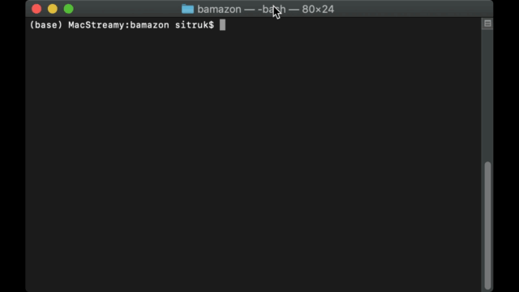

# 𝛃AMAZON
bAMAZON is an Amazon-like storefront supported by a MySQL database. The app takes in orders from customers and depletes stock from the store's inventory. As an added bonus, it can track product sales across one's store's departments and then provide a summary of the highest-grossing departments in the store.

# demo - screencapture
A live example of good 'ol bAMAZON in action!  

# featured technology
- [console.table](https://www.npmjs.com/package/console.table)
- [inquirer](https://www.npmjs.com/package/inquirer)
- [MySQL](https://www.mysql.com/)
- [Node.js](https://nodejs.org/en/)  

# app features
- CLI UI with user prompts via **Inquirer,js** which provides a simple user experience. 
- **Customers** can *purchase* products from the available products in the database. 
- **Managers** can *add* inventory and new products to the databse. 
- **Supervisors** can *view* profit data by department and *add* new departments. 
- Console table provides a GUI for product, inventory, and department data from within the CLI.
- User input validation (user <=> mysql) is key feature that prevents supervisors from overdrawing on purchases.

# three-part application 
### **Customer View**
run: node bamazonCustomer.js

    PRODUCTS TABLE:
        * item_id (unique id for each product)
        * product_name (Name of product)
        * department_name
        * price (cost to customer)
        * stock_quantity (how much of the product is available in stores)

    USER CAPABILITIES: 
        Access/Purchase 10 products
    
    USER FLOW: 
        inquirer.js used to prompt user:
            * ID of product to buy
            * Count of units of product to buy
        On order, db is checked for adequate supply: if success
            * user is prompted further for fulfillment (complete the order)
            * user gets confirmation prompt
        On order, db is checked for adequate supply: if inadequate
            * `Insufficient quantity!`, is logged

### **Manager View**
run: node bamazonManager.js

    USER CAPABILITIES: 
        * View Products for Sale
        * View Low Inventory
        * Add to Inventory
        * Add New Product
    
    USER FLOW:
        inquirer.js used to prompt user:
            * View Inventory
            * Add to Inventory

### **Supervisor View**
run: node bamazonSupervisor.js

    DEPARTMENTS TABLE:
        * department_id
        * department_name
        * over_head_costs

    USER CAPABILITIES: 
       * View Product Sales by Department
       * Create New Department
    
    USER FLOW:
       * When a supervisor selects `View Product Sales by Department`, gets summary table like below:

| department_id | department_name | over_head_costs | product_sales | total_profit |
| ------------- | --------------- | --------------- | ------------- | ------------ |
| 01            | Electronics     | 10000           | 20000         | 10000        |
| 02            | Clothing        | 60000           | 100000        | 40000        |

    FEATURES: 
        `total_profit` is calculated on the fly (difference between over_head_costs and product_sales) and does not need tp be stored in any database. It instead utilizes a custom alias.

# sitruks-inspiration-origin-homage
**framework of the app was helped along immensely by Paul,** [the person who rele@rnt me the benefits of CRUD](https://github.com/paulz92/Bamazon)

    Built with ♥︎ for my Bootcamp Project